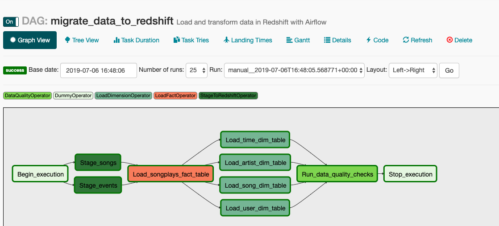

# Data Pipelines Project with Airflow

This repository contains the solution to the Data Pipelines project
of the Udacity's Data Engineering Nanodegree program.  

The project is an implementation of a `DAG` in Apache Airflow, that 
moves data from Amazon S3 `json` and `csv `files to Redshift.    

The process consists of first copying the raw data to staging tables 
(`stage_songs`, `stage_events`) and then creating a fact table 
(`songplays`), finally creating all dimension tables and performing 
data quality checks.   



## Files in the project

- `create_tables_dag.py`: DAG to create the database schema of the application. 
- `migrate_data_dag.py`: DAG that performs the ETL process of the application.
- `stage_redshift.py`: Operator to move S3 data to Redshift. 
- `load_fact.py`: Operator to move data from staging tables to fact tables.
- `load_dimension.py`: Operator to move data to dimension tables.
- `data_quality.py`: Operator to verify all tables have data.
- `docker-compose.yml`: Docker-compose file to easily start Apache Airflow locally.

## Starting Apache Airflow with Docker

This project provides a `docker-compose.yml` file which allows you to run
Apache Airflow with Docker. The Docker Compose file sets up the folders 
for the _dags_ and _plugins_. It also starts an instance of Postgres
that stores the metadata.

```bash
docker-compose up -d
```

## Running the project

After you start your instance of Airflow, just go to the DAG menu and choose the 
`migrate_data_to_redshift` DAG. If you want to manually start the DAG, you can 
click the start button. 


